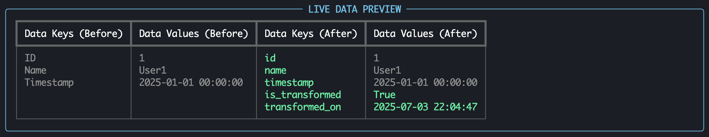

  

<h3 align="center">Bourne</h3>

<a href="#demo">View Demo</a>
·
<a href="#cicd">View Docs</a>
·
<a href="#️architecture">View Architecture</a>

## :gear: Features

- [x] **Multi-agent orchestration**: Modular agents for data ingestion, validation, transformation, and storage.
- [x] **Extensible agent framework**: Easily add new agent types or transformation modes.
- [x] **Dynamic terminal dashboard**: Live workflow progress, color-coded statuses, and real-time logs.
- [x] **Live data preview**: Before/after record comparison with field-level change highlighting.
- [x] **Config-driven pipelines**: Easily customize workflows and connectors via external JSON files.
- [x] **Support for JSON and NDJSON**: Ingestion and output for both formats.
- [x] **Schema validation**: Input/output validation using Pydantic v2 (TypeAdapter.validate_python).
- [x] **Retry logic and dependency handling**: Automatic retries, dependency resolution, and stall detection.

 

_See [open issues](https://github.com/imjuliengaupin/bourne/issues) for a full list of proposed features and known issues._

    (<a href="#readme-top">back to top</a>)

## :repeat: <a name="ci-cd">CI/CD</a>

- [x] **Automated builds**: Push and pull requests trigger a [GitHub Actions](https://docs.github.com/en/actions/using-workflows) workflow
- [x] **Code linting**: Enforced with `pylint`
- [x] **Static type checking**: Enforced with `mypy`
- [x] **Unit testing**: Automated with `pytest`
- [x] **Code coverage**: Measured with `pytest-cov` and reported to [Coveralls](https://coveralls.io/)
- [x] **Documentation generation**: Automated with `pdoc3`

 

_See the latest [workflow runs and artifacts](https://github.com/imjuliengaupin/bourne/actions) for build status and reports._

    (<a href="#readme-top">back to top</a>)

## :building_construction: Architecture

    (<a href="#readme-top">back to top</a>)

## :computer: Demo

Live rendering of agent workflow progress and logs in a terminal dashboard.

 

Live rendering of data before **and** after agent transformations are applied. Activates during any `DataTransformationAgent` workflow step, where transformations applied are highlighted in
<b>green</b>).

Sample transformation exhibited: `lowercase_keys`

    (<a href="#readme-top">back to top</a>)

## :pencil: <a name="license">License</a>

All rights reserved.

This source code is proprietary. Unauthorized copying, modification, distribution, or use is prohibited without explicit permission from the author.

    (<a href="#readme-top">back to top</a>)

